# R1.15-I 员工操作图解与完整图集

来源：本轮实际 NSIS 安装版 R1.15-I / 应用 1.1.9 / 源码 25b96da877389b7cfb34649e0cc9f7e9966df046。截图 1464 × 895 像素，应用缩放 100%。全部企业、内容和图片为合成资料，平台/云请求为零。

这是同机管理员账户的安装版与新库验收；标准用户和独立干净 Windows 电脑未执行。手机预览展示桌面原图和操作说明，不是手机产品或新电脑证据。

[开始使用](../department-pilot-quickstart.md) · [首日清单](../day-one-acceptance.md) · [离线手机可读图集](index.html) · [手机预览](phone-preview.png) · [脱敏验收证据](evidence.json)

## 首次进入新库

从 Start-Pilot.cmd 启动并核对 I 身份。空库点击右上角“创建企业资料”，填写企业名称和简称。

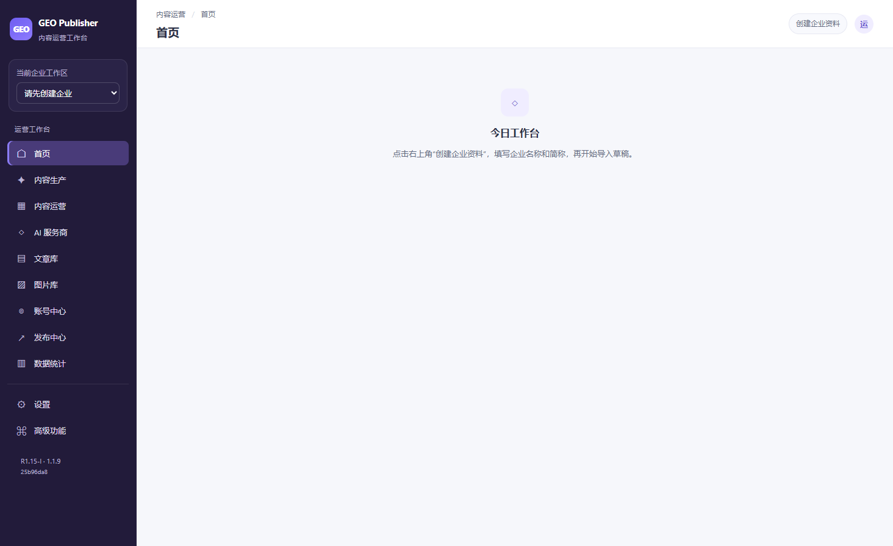

## 导入字段与预览

在内容运营的批量导入页选择模板，核对企业和字段映射；向下滚动检查行预览，再选择 Import as Draft。不会创建发布任务。

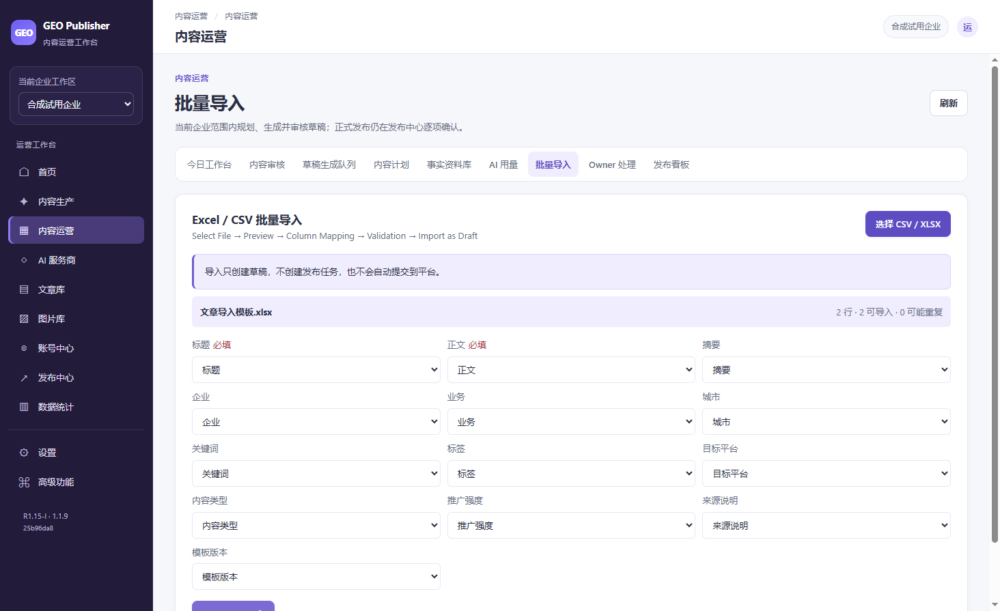

## 逐行校验错误

合成问题文件有四行错误，零行可导入。下方显示缺失标题、企业不匹配和正文等原因；修改文件后重新预览。

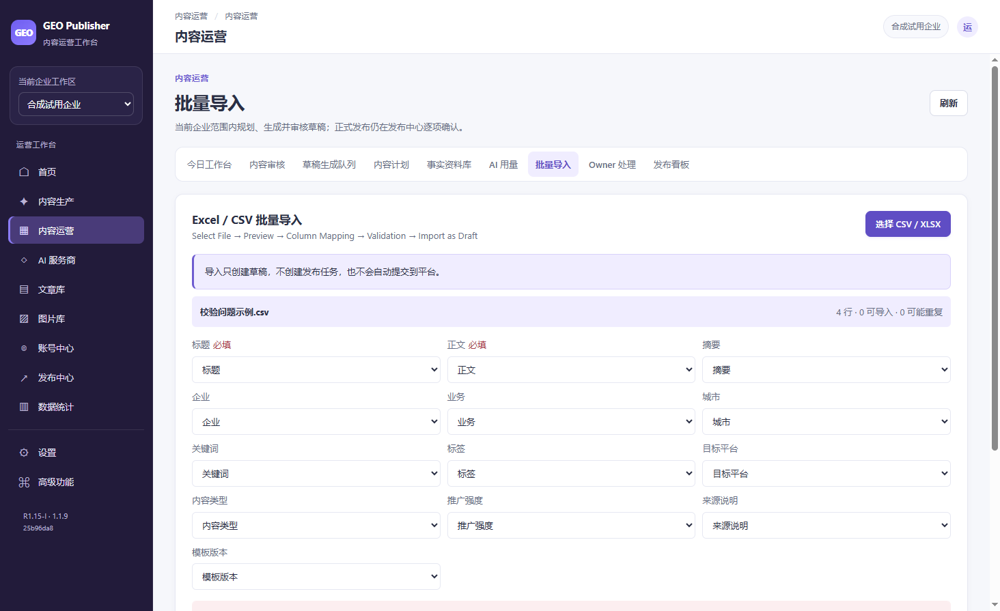

## 编辑与自动保存

在文章库点“修改”，等待“已保存”。重开后明确恢复上次编辑；提交工作副本后仍需重新审核。

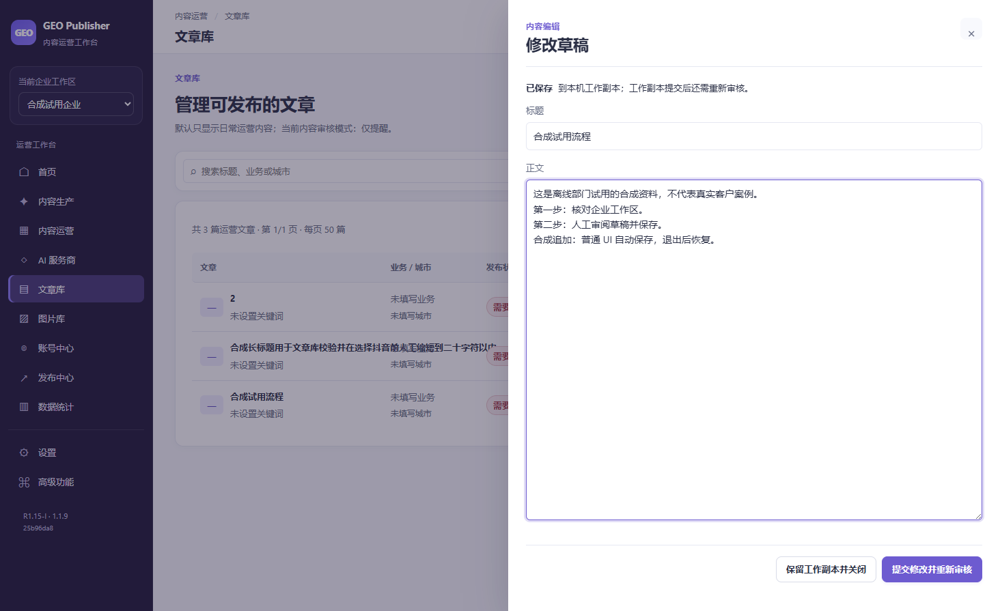

## 人工审核后的文章

仅一条合成流程经过本次人工审核。另两条仍需处理；“可发布”表示内容层状态，账号与平台门禁仍需逐项核对。

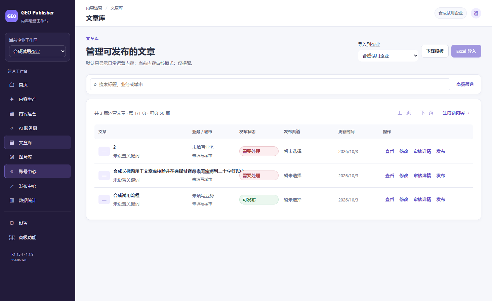

## 无账号时的发布保护

新库没有已验证账号，开始发布按钮不可用。本轮没有准备远端草稿、媒体上传或最终提交。

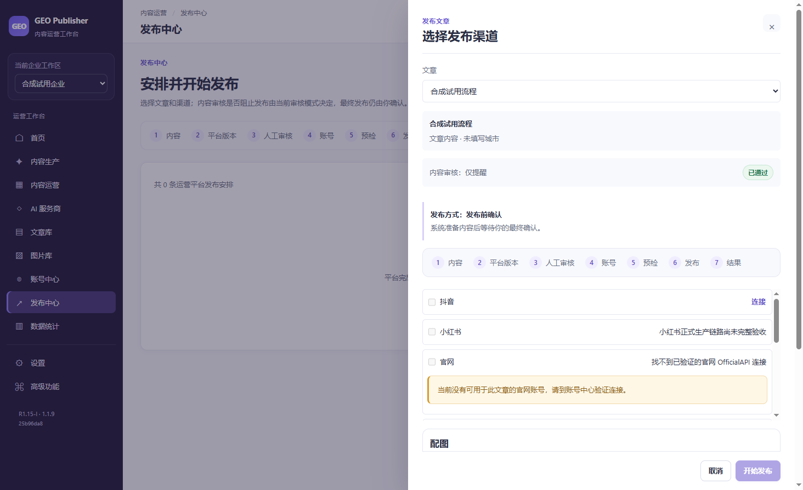

## AI 服务商未配置

现有服务商预设可见，API Key 为空，没有保存或测试连接。今晚不产生 GEO 外部 AI 请求。

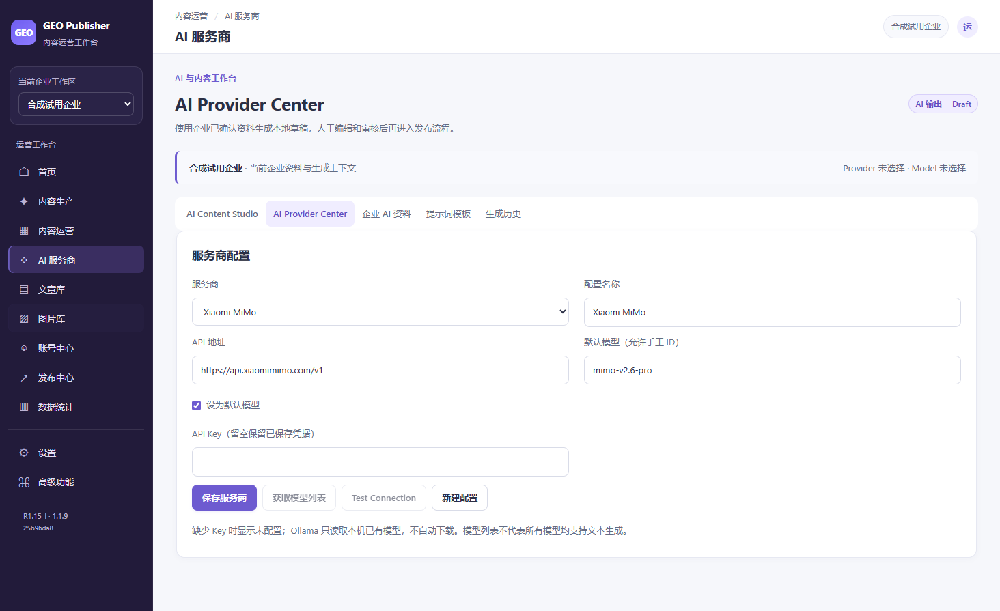

## 账号中心的新库状态

当前企业没有账号。正式凭据只能由 Owner 后续从安全入口配置，不能继承或复制历史测试凭据。

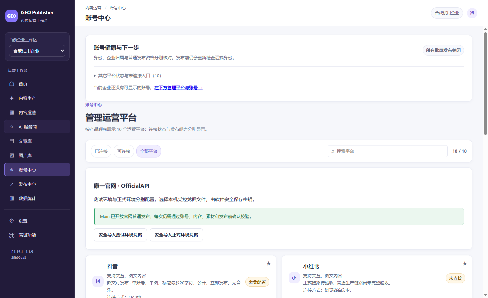

## 今日工作台

合成资料的待审与已审状态可见；没有可信账号检查结果。首页计数不能替代真实平台验收。

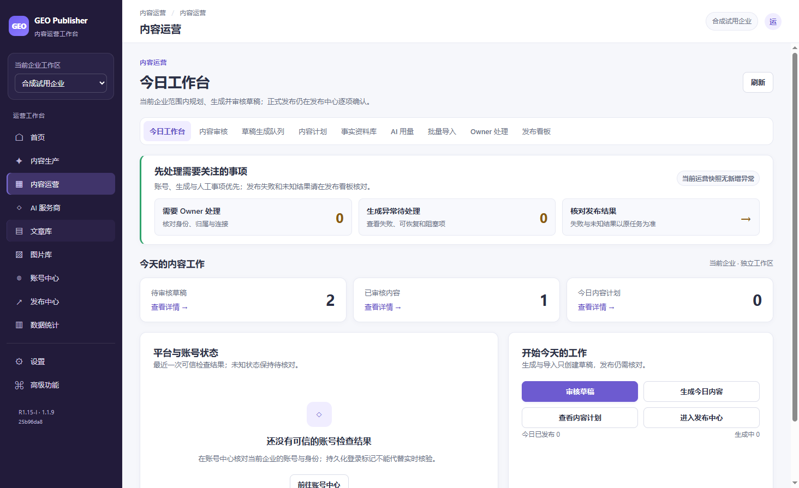

## Owner 处理入口

当前新库处理项为零。页面下方 H 交付清单是历史待核对记录，不能当作这个空库已经绑定了历史账号。

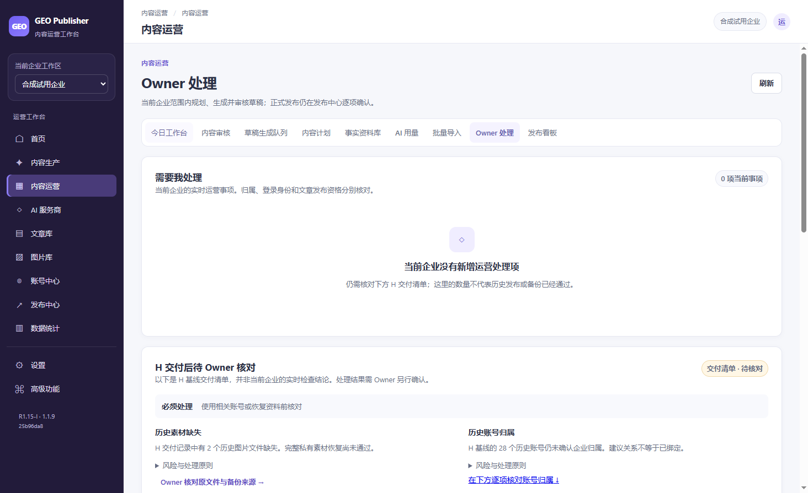

## 确认当前版本

在设置展开“构建与数据版本详情”，核对 R1.15-I、1.1.9 和 SOFTWARE.json 中的源码标识。main 仍为 H Candidate。

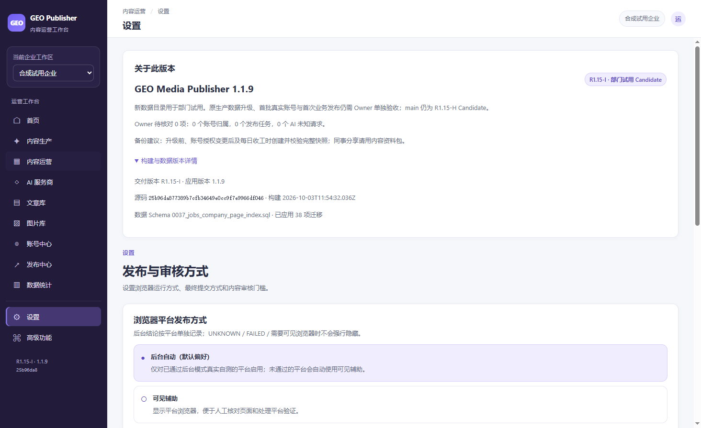

## 创建完整新库快照

此图拍于创建前。实际 UI 随后正常关闭、生成 Complete 快照、校验并恢复到另一隔离目录；恢复后自动执行保持关闭。

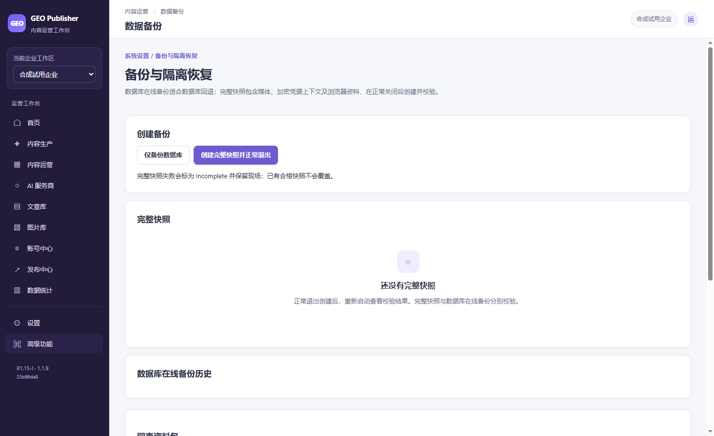

## 结果未知的只读演示

SIMULATED：内存只读夹具展示 Unknown 和历史状态。真实数据库没有发布任务或记录，不代表真实平台通过；未知结果不可重发。

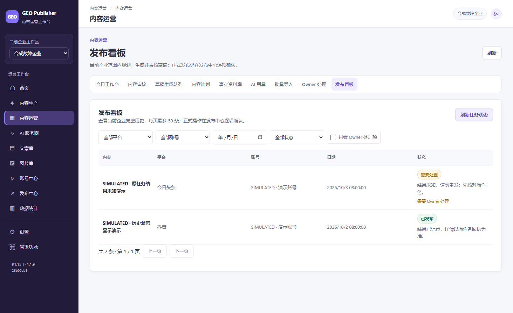
